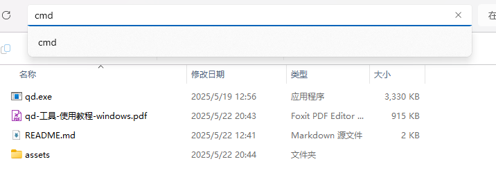

# qd-工具-使用教程-windows

## 一，下载最新工具

```bash
git clone https://github.com/TrueAc/nbu-qd-tool.git
```

## 二，获取cookie（学生认证信息）

1. 打开[宁波大学签到页面](https://attendance.nbu.edu.cn/)  
    若未登陆，请先登陆
2. 在首页按动F12启动开发者视图  
    在“开发者视图”中选择最上方的“网络”，此时网络中的内容为空。


3. 点击左侧“课程列表”  
    此时网络中出现了一些新的内容


4. 选择新出现的四条内容中的“getCourse”选项  
    查询其中详细信息  
    在“请求标头中”，找到“Cookie”选项，并且复制全部信息。


## 三，使用工具

1. 打开第一步中文件的下载位置并进入nbu-qd-tool

2. 在文件栏上方搜索栏输入“cmd”，打开命令行页面



　　​​

3. 输入 qd -h,显示右方信息，则说明工具可以正常启用

```bash
nbu-qd-tool>qd -h
Usage: qd [OPTIONS] --cookie <COOKIE>

Options:
  -c, --cookie <COOKIE>  直接粘贴cookie值
  -w, --watch            启用监听模式
  -h, --help             Print help
```

4. 运行工具  
    将获取的cookie替换‘your_cookie_there’，回车键后工具将自动开始监听是否存在课程未签到，若未签到，工具是自动进行签到。

```bash
nbu-qd-tool>qd -c your_cookie_there -w
```

　　‍
